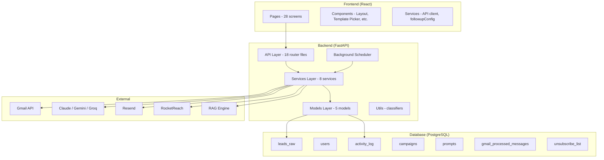
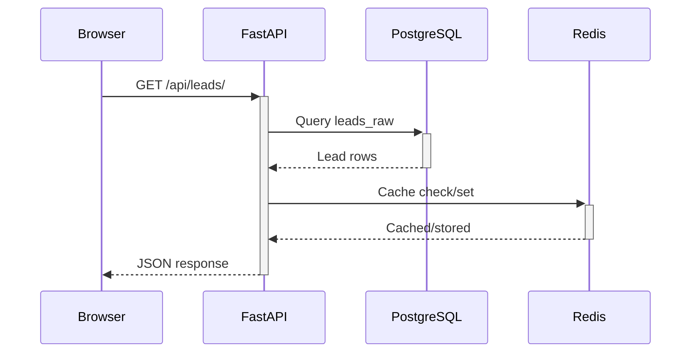
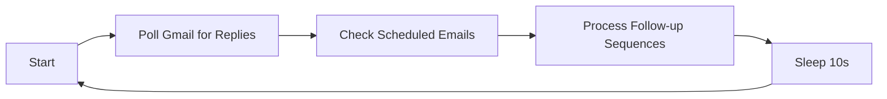

# System Architecture

## Tech Stack

```
Frontend         Backend              Database       External Services
┌─────────┐     ┌──────────────┐     ┌────────┐     ┌──────────────┐
│ React 19 │────▶ FastAPI      │────▶│PostgreSQL│────▶│ Gmail API    │
│ Vite 8   │     │ Gunicorn     │     │ (Neon) │     │ Google Drive │
│ Tailwind4│     │ Redis        │     └────────┘     │ Google Cal   │
│ Recharts │     └──────────────┘                    │ Resend       │
└─────────┘                                          │ Claude/Gemini│
                                                     │ Groq (LLM)   │
                                                     │ RocketReach  │
                                                     │ RAG System   │
                                                     └──────────────┘
```

## Component Overview



## Request Flow (Typical)



## Background Scheduler

Runs every 10 seconds via `asyncio.to_thread()` in `main.py`:



**Order matters**: Replies are checked BEFORE follow-ups are sent to prevent sending a follow-up to someone who just replied.

## Deployment

- **Backend**: Render (Gunicorn + Uvicorn workers)
- **Frontend**: Render (Static site, Vite build)
- **Database**: Neon (PostgreSQL)
- **Redis**: Render Redis (caching, rate limiting)
- **Environment vars**: `.env` in `backend/app/.env`

## Key Design Decisions

| Decision | Rationale |
|----------|-----------|
| Per-user data isolation | `(email, user_id)` unique constraint — same email can exist for different users |
| Push + Poll reply detection | Push is real-time but Google can throttle; poll is reliable fallback every 10s |
| Cross-account stop | When a reply is detected, the same email and domain are stopped across all 5 accounts |
| Separate activity_log | Full audit trail independent of lead record updates |
| AI classification in reply handler | Every inbound reply is AI-classified for intent (INTERESTED, NOT_INTERESTED, etc.) |
