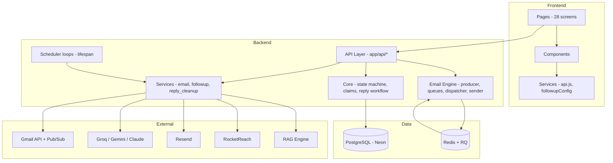

# LeadStream — System Architecture

> **Status legend**: ✅ Implemented & verified in code · 🟡 Partial / script exists but live status unverified · ⏳ Planned (not yet built)
>
> This document describes the **current implemented system**. Anything marked ⏳ or 🟡 is *not* yet production-ready and must not be treated as such.
> Last verified against code: **3 Sep 2026**.

---

## 1. Product Overview

**LeadStream is an internal investment-banking outreach automation tool** that classifies leads, generates AI email drafts, manages Gmail follow-ups, detects/classifies replies, and tracks the deal pipeline.

**Core flow**:

```text
Lead Ingestion → Classification → AI Draft → Approval → Schedule/Send
      → Follow-up → Reply Detection → Reply Classification → Pipeline Update → Meeting/Close
```

Target users are internal team members (each with their own Gmail-connected sender account). There is **no organization/workspace model** — isolation is **per `user_id`** with an ADMIN role for global visibility.

---

## 2. System Context

```text
                    ┌─────────────────────────────┐
                    │      React Frontend (SPA)    │
                    └──────────────┬──────────────┘
                                   │ HTTP/JSON (Bearer session token)
                    ┌──────────────▼──────────────┐
                    │      FastAPI Backend         │
                    │  Auth → Ownership → Business │
                    │  Rules → State Machine       │
                    └──────┬──────────────┬───────┘
                           │              │
                 ┌─────────▼──────┐  ┌────▼──────────────┐
                 │  PostgreSQL    │  │  Redis + RQ       │
                 │  (Neon)        │  │  (4 queues + DLQ) │
                 └────────────────┘  └────┬──────────────┘
                                          │
                              ┌───────────┼────────────┐
                              │           │            │
                    ┌─────────▼───┐ ┌─────▼─────┐ ┌────▼──────────┐
                    │  Dispatcher │ │  Worker   │ │  Scheduler    │
                    │  (pool.py)  │ │  sender   │ │  (lifespan)   │
                    └─────────────┘ └─────┬─────┘ └───────────────┘
                                          │
                    ┌─────────────────────┼──────────────────────┐
                    │                     │                      │
               ┌────▼─────┐        ┌──────▼──────┐        ┌──────▼──────┐
               │ Gmail API│        │ LLMs        │        │ Resend /    │
               │ + Pub/Sub│        │ Groq→Gemini │        │ RocketReach │
               │          │        │ →Claude     │        │ RAG         │
               └──────────┘        └─────────────┘        └─────────────┘
```

---

## 3. Architecture Diagram


```mermaid
graph TB
    subgraph Frontend
        P[Pages - 28 screens] --> C[Components]
        C --> S[Services - api.js, followupConfig]
    end

    subgraph Backend
        API[API Layer - app/api/*]
        SVC[Services - email, followup, reply_cleanup]
        CORE[Core - state machine, claims, reply workflow]
        ENG[Email Engine - producer, queues, dispatcher, sender]
        SCH[Scheduler loops - lifespan]
    end

    subgraph Data
        PG[(PostgreSQL - Neon)]
        RED[(Redis + RQ)]
    end

    subgraph External
        GMAIL[Gmail API + Pub/Sub]
        LLM[Groq / Gemini / Claude]
        RESEND[Resend]
        RR[RocketReach]
        RAG[RAG Engine]
    end

    P --> API
    API --> CORE
    API --> SVC
    API --> ENG
    SVC --> LLM
    SVC --> GMAIL
    SVC --> RESEND
    SVC --> RR
    SVC --> RAG
    CORE --> PG
    ENG --> RED
    RED --> ENG
    SCH --> SVC
```

**Middleware chain** (outer → inner): `CorrelationId → CORS → Prometheus → RateLimit → Auth`.

---

## 4. Technology Stack

| Layer | Technology | Status |
|---|---|---|
| **Frontend** | React 19, Vite, React Router 7, Tailwind CSS 4, Axios, TanStack Query, Recharts, react-quill, xlsx/papaparse, PDF.js, lucide | ✅ |
| **Backend** | FastAPI, uvicorn/gunicorn, Pydantic v2, structlog, psycopg2 (DictCursor) | ✅ |
| **Database** | PostgreSQL on Neon (managed) | ✅ |
| **Cache/Queue** | Redis + RQ — queues `emails_high`, `emails_normal`, `emails_low`, `emails_scheduled` + DLQ | ✅ |
| **Gmail** | `google-api-python-client`, OAuth2, Pub/Sub push, drafts/send/watch, Drive (pitch decks) | ✅ |
| **AI** | Groq (primary) → Gemini → Claude fallback; structured JSON + Pydantic validation | ✅ |
| **System email** | Resend (system/notification emails) | ✅ |
| **Enrichment** | RocketReach API | ✅ |
| **Observability** | Prometheus metrics (`/metrics`), structlog JSON logs, security events, activity_log | ✅ |
| **Secrets** | `.env` in `backend/app/.env` (production env), `TOKEN_ENCRYPTION_KEY` for OAuth-at-rest | ✅ |

> **Note**: `frontend/src/services/api.js` (not `.ts`) is the file bundled by Vite.

---

## 5. User & Access Model

### 5.1 Identity & authentication ✅

```text
User → Login → Session token (Bearer) → AuthMiddleware verifies session
     → user_id from verified session OVERRIDES any client-supplied X-User-Id
```

- Sessions stored in `sessions` table (`token`, `expires_at`). Invalid/expired → `401`.
- Header-spoofing (`X-User-Id`) is impossible — the middleware rewrites the header from the verified session.
- Public (unauthenticated) paths: login, Google OAuth callback, Gmail Pub/Sub webhook, tracking pixels, unsubscribe/resubscribe pages, health endpoints.

### 5.2 Roles

| Role | Scope |
|---|---|
| **USER** | Own resources only (`user_id` scoping on every query) |
| **ADMIN** | Global read/manage across all users (controlled, explicit endpoints) |

### 5.3 Data ownership matrix ✅ (enforced in API queries)

| Resource | Owner | Admin | User |
|---|---|---|---|
| Lead (`leads_raw`) | `user_id` | ✅ | Own only |
| Campaign | `user_id` | ✅ | Own only |
| Gmail account / OAuth | `user_id` | controlled | Own only |
| Email job (queue) | `user_id` | controlled | Own only |
| Activity log | user/lead | ✅ | Own |
| Export | user | ✅ | Own only |
| AI context | resource owner | controlled | Own only |

### 5.4 Core security rule ✅

```text
USER ID → AUTHENTICATED CONTEXT → RESOURCE OWNERSHIP CHECK → BUSINESS RULE → STATE MACHINE → SIDE EFFECT
```

AI, queue, scheduler, frontend, or URL parameters must **never** bypass ownership.

---

## 6. Database Architecture

### 6.1 ER diagram ✅

```text
users
  ├── leads_raw ──┐            (leads_raw.user_id → users.id)
  │    ├── activity_log        (activity_log.lead_id, user_id)
  │    ├── gmail_thread_id / gmail_message_id  (Gmail linkage)
  │    └── unsubscribe_list    (global opt-out by email)
  ├── campaigns ── recipients ── campaign_events
  ├── sessions                 (auth tokens)
  └── (google tokens — encrypted, columns on users)

email_idempotency   (idempotency_key UNIQUE — one send per key)
gmail_processed_messages (message dedup)
prompts, reminders, family_offices, company_registry
```

### 6.2 Key tables ✅

| Table | Purpose |
|---|---|
| `users` | Accounts, roles, credits, per-user outreach limits, encrypted Google tokens |
| `leads_raw` | Core lead + outreach state (see state machine §9). Composite unique `(email, user_id)` |
| `activity_log` | Immutable audit trail (`EMAIL_SENT`, `AUTO_FOLLOWUP_SENT`, `FOLLOWUP_STOPPED`, `BOUNCED`, `LEAD_DELETED`, ...) |
| `email_idempotency` | Atomic send-claim table, `UNIQUE(key)` — only one worker may send per key |
| `gmail_processed_messages` | Reply dedup across push/poll cycles |
| `sessions` | Bearer session tokens with expiry |
| `unsubscribe_list` | Global opt-out list (checked before any send) |
| `campaigns` / `recipients` / `campaign_events` | Campaign definitions + tracking |
| `prompts` | Configurable AI prompt templates |

### 6.3 Lead ownership key indexes ✅

```text
UNIQUE (email, COALESCE(user_id, -1))   -- one lead per email per user
INDEX  (email_status, user_id), (user_id), (followup_status), (LOWER(email))
```

---

## 7. API Architecture

- **v1 router** (`app/api/v1`) primary; legacy router maps `/api/*` → v1 (backward compat).
- ~20 API modules: `auth`, `leads`, `drafts`, `gmail`, `campaigns`, `companies`, `family_offices`, `dashboard`, `metrics`, `admin_dashboard`, `tracking`, `reminders`, `prompts`, `rocketreach`, `public_email`, `users`, `admin`, `intelligence`, `ingest`, `generate`, `health`.
- **`leads.py`** is the biggest business surface: CRUD, followup pipeline (approve/send/stop/respond), bulk ops, export.
- **`drafts.py`** — AI draft generation, review queue, schedule, send flow. `markdown_to_html()` is ~320 lines of regex — never call in loops.
- **`gmail.py`** — sync, reply detection, bounce detection, Pub/Sub webhook, inbound deals.
- **Security pattern** (verified): every resource query is scoped `WHERE id = ? AND user_id = ?`; client-supplied user identity is never trusted (see §5).

---

## 8. Lead Lifecycle ✅

```text
Import (CSV/manual/Gmail) → NEW → Classification (investor/client + fit)
  → AI Draft → DRAFT_PENDING (review queue) → Approved → SCHEDULED (drip slot)
  → SENT → FOLLOWUP_ACTIVE → (reply?) → REPLIED → MEETING_REQUIRED / CLOSED_WON / CLOSED_LOST
```

Follow-up sequence (per sequence type):
- **INVESTOR**: Day 0 → 2 → 5 → 8 (max 3 follow-ups, `followup_stage < 3`)
- **CLIENT**: Day 0 → 2 → 4

---

## 9. State Machine ✅

### 9.1 email_status

```text
PENDING → SCHEDULED → SENT → REPLIED
                            → CLOSED   (NOT_INTERESTED / deal done)
                            → BOUNCED
```

### 9.2 followup_status

```text
IDLE → ACTIVE → COMPLETED (stage >= max)
             → STOPPED    (reply / manual stop / bounce / unsubscribe / lead deleted)
```

### 9.3 Formal transition table ✅ (enforced in `app/core/pipeline/state_machine.py`)

| From | Event | To | Guard |
|---|---|---|---|
| NEW | draft_generated | DRAFT_PENDING | lead exists |
| DRAFT_PENDING | approved | SCHEDULED | owner |
| SCHEDULED | send_success | SENT | Gmail valid |
| SENT | no_reply_due | FOLLOWUP_ACTIVE | not stopped |
| SENT | reply | REPLIED | verified thread |
| FOLLOWUP_ACTIVE | reply | REPLIED | verified owner |
| REPLIED | meeting | MEETING_REQUIRED | intent validated |

**Terminal states**: `BOUNCED`, `UNSUBSCRIBED`, `CLOSED_WON`, `CLOSED_LOST`, `STOPPED`. Invalid transitions fail — the AI **recommends** state; code decides.

---

## 10. AI Architecture ✅

```text
AI Request → Prompt Builder (user-scoped context only)
   → Primary: Groq → failure/invalid → Gemini → failure/invalid → Claude
   → Structured JSON output
   → Pydantic schema validation
   → Business-rule validator (app/core/reply/validator.py, decline_phrases.py)
   → State machine decides the transition
   → DB write
```

- **LLM output never writes to DB directly** — schema + business validation always precede writes. ✅
- Prompt is built only from the **current user's** lead + email context — no tenant/user identity is sent to the LLM, and no broad DB search is given to the model. ✅
- Classifiers: reply intent (`MEETING_REQUESTED | INTERESTED | NEEDS_MORE_INFO | NOT_INTERESTED`), lead classification (investor/client, fit score), campaign resolution, follow-up generation.
- Feature flags gate AI behavior (e.g. `use_reply_classifier`). ✅

---

## 11. Email Engine ✅

```text
producer.py → enqueue_job / enqueue_scheduled
queue/      → registry (4 queues + DLQ), connection (Redis pool, socket timeouts)
worker/     → dispatcher (pool.py) + sender (send_email_job) + retry (3 retries w/ backoff) + rate limiter
template/   → Jinja2 HTML templates
```

- **Dispatcher**: single thread per app process; pops from `emails_high` → `emails_normal` → `emails_low`; holds a slot pool (`acquire_slot`); health surfaced via `/healthz` + `/api/health/ready`.
- **Sender guards** (verified): worker re-fetches lead/user from DB and rejects leads whose state no longer allows sending (COMPLETED/REPLIED/BOUNCED/UNSUBSCRIBED/STOPPED/deleted) — **queue payload is never trusted as truth**. ✅
- **Idempotency**: atomic `INSERT ... ON CONFLICT (key) DO NOTHING` on `email_idempotency(key)`; only the claiming process sends. ✅
- **Per-user rate limiting** in worker + API-level Redis sliding-window limiter (default 100 req/60s). ✅

### Job payload

```json
{ "job_id": "...", "user_id": 5, "lead_id": 123, "campaign_id": null,
  "action": "followup", "sequence_step": 2, "idempotency_key": "followup_lead123_stage2" }
```

Job IDs embed the lead id (`followup_lead123_stage2`) — this is what queue-cancellation matches on.

---

## 12. Follow-up Engine ✅

- **`process_outreach_sequences()`** — picks leads where `followup_status='ACTIVE'`, `email_status='SENT'`, `is_responded=FALSE`, stage < max, working hours, `unsubscribe_list` check, drip pacing.
- Runs under a **distributed lock** (`app/core/scheduler_lock.py`) so multiple app instances can't double-send. ✅
- Pre-send guard (verified): lead exists ∧ user owns lead ∧ status allows ∧ not replied ∧ not bounced ∧ not unsubscribed ∧ not meeting-required ∧ valid stage ∧ Gmail belongs to user. ✅
- Working hours: **followup 8:30 AM – 8 PM IST, Mon–Fri** (DB clock, not machine clock). ✅
- **On reply/stop/delete/unsubscribe/bounce → `cancel_pending_jobs_for_leads()` purges the lead's queued + delayed jobs** from all priority queues and the scheduled registry (added 3 Sep 2026). ✅

---

## 13. Reply Detection ✅

### 13.1 Two paths

1. **Push (real-time)**: Google Pub/Sub → `POST /api/gmail/pubsub-push` → history scan → dedup → `handle_potential_reply`. ✅
2. **Poll (fallback)**: `reply_polling_loop` at **9 AM / 1 PM / 5 PM IST Mon–Fri** (configurable) + startup catch-up within 2h of a missed slot. ✅
   - This replaced the old continuous 30s polling (~97% less Gmail quota). ✅

### 13.2 Matching priority ✅ (documented security chain)

```text
Incoming Gmail Event
   → Gmail account identity (which account received it)
   → Thread ID
   → Provider message relationship
   → Exact sender email
   → User-scoped lead lookup (email_status IN SENT/REPLIED/CLOSED/SCHEDULED)
   → Reply validator → State machine
```

- Dedup via `gmail_processed_messages` — one message processed once across push+poll. ✅
- Bounce detection (mailer-daemon / Undeliverable) before reply handling. ✅
- **No automatic cross-user ownership reassignment.** The old cross-account auto-retarget was **removed** — ambiguous cross-account matches are flagged for manual review instead. ✅
- Cross-account **stop** still applies (same email / same domain leads get `followup_status='STOPPED'`) — stopping followups ≠ transferring ownership. ✅
- On reply: lead marked REPLIED, followups stopped, **queued followup jobs purged**, reminder auto-created for `MEETING_REQUESTED`. ✅

---

## 14. Queue & Scheduler

### 14.1 Scheduler loops ✅ (started in lifespan, `app/main.py`)

| Loop | Cadence | Work | Lock |
|---|---|---|---|
| `scheduler_loop` | followup every 5s; scheduled every 15s; autopilot sweep ~5 min | follow-ups, drip-send scheduled emails, auto-pilot draft promotion | `_followup_lock`, `_scheduled_lock`, `_autopilot_lock` |
| `reply_polling_loop` | 9 AM / 1 PM / 5 PM IST (Mon–Fri) | Gmail reply polling | `_reply_poll_lock` |
| `reply_cleanup_loop` | 10 AM / 4 PM IST (Mon–Fri) | cleanup replied leads + admin report | `_reply_cleanup_lock` |
| `maintenance_loop` | 8 AM / 8 PM IST (Mon–Sat) | placeholder (Gmail watch renewal) | `_maintenance_lock` |

- All cadence/timing is configurable via env (`SCHEDULER_*`), DB-clock based, weekend-skipping, with a **10-minute startup cooldown** holding automated dispatch after boot. ✅
- The **email dispatcher** (`start_dispatcher()` in lifespan) drains the priority queues — separate from the DB-state schedulers. Both must run for full throughput. ✅

### 14.2 Queue lifecycle ✅

```text
Created → Queued (priority queue or scheduled registry) → Claimed (idempotency)
   → Processing → Success
Failure: Processing → Retry (3x backoff) → Retry limit → DLQ
Cancellation: lead deleted / replied / unsubscribed / stopped → cancel_pending_jobs_for_leads()
```

### 14.3 Multi-instance safety ✅

- Distributed locks for every scheduler task (Redis-backed critical section) — multiple Render instances won't double-send. ✅
- Idempotency claim is the final arbiter for worker duplicate protection. ✅

---

## 15. External Integrations ✅

```text
                    LeadStream
                       │
        ┌──────────────┼──────────────┐
        ↓              ↓              ↓
     Gmail           LLMs         RocketReach
      API         Groq/Gemini/       │
      │            Claude            ↓
      ↓              ↓           Enrichment
  Email +         Drafting
  Replies
      │
   Pub/Sub (push)
      ↓
 LeadStream → Resend → System/notification emails
 LeadStream → Google Drive → pitch-deck upload (reply PDFs)
 LeadStream → RAG engine → reply analysis   [⚠️ currently unreachable in prod — see §26]
```

---

## 16. Security Architecture ✅

```text
User → Session Auth → Authenticated User ID → Authorization (ownership) → Business Action
ADMIN → all permitted resources | USER → own resources only
```

### Implemented controls (verified in code)

| Control | Where | Status |
|---|---|---|
| Session auth, X-User-Id spoof-proof | `AuthMiddleware` (main.py) | ✅ |
| Resource ownership in every query | API layer (`user_id` scoping) | ✅ |
| Worker re-validation + state guards | `sender.py` | ✅ |
| OAuth tokens encrypted at rest | `utils/token_encryption.py` (Fernet, `TOKEN_ENCRYPTION_KEY`) | ✅ |
| Idempotency race fix | `email_idempotency` UNIQUE + atomic claim | ✅ |
| Queue job cancellation on reply/delete/stop | `cancel_pending_jobs_for_leads()` | ✅ |
| Cross-account auto-retarget removed | `gmail.py` (flag for review) | ✅ |
| AI output validation before DB write | Pydantic + business validator | ✅ |
| Export authorization + audit | `leads.py` export endpoints | ✅ |
| Rate limiting | Redis sliding window (API) + per-user (worker) | ✅ |
| Security event logging | `core/security_logging.py` (`AUTH_FAILURE`, `CROSS_USER_ACCESS_ATTEMPT`, ...) | ✅ |
| Sensitive-data redaction in logs | `core/security_logging.py` redaction filter | ✅ |
| Cross-user / penetration tests | `tests/unit/test_cross_user_security.py`, `test_penetration.py`, `test_endpoint_security.py`, `test_tenant_isolation.py` | ✅ |
| Distributed scheduler locks | `core/scheduler_lock.py` | ✅ |

### Security event types emitted

```text
AUTH_FAILURE          CROSS_USER_ACCESS_ATTEMPT     ORPHAN_REPLY
GMAIL_AUTH_FAILURE    QUEUE_BACKLOG                 HIGH_FAILURE_RATE
```

---

## 17. Data Protection ✅

### 17.1 OAuth credential flow ✅

```text
Google OAuth → Access/Refresh token → encrypt_token() (Fernet, AES-128-CBC + HMAC-SHA256)
   → stored as ciphertext in DB → runtime decrypt_token() only when calling Gmail
```

- `TOKEN_ENCRYPTION_KEY` is required in production; tokens are never logged (redaction filter). ✅
- `invalid_grant` / revoked access → token NULLed + cache invalidated + job fails safely to DLQ, no infinite retries. ✅

### 17.2 Sensitive data

- Leads hold names, emails, phones, companies, LinkedIn, notes, AI-generated intel — accessible **only to the owning user / admin**. ✅
- Exports are bulk-access operations: ownership-scoped + audited. ✅
- Unsubscribe (RFC 8058 one-click + tokenized confirmation page) removes leads from all automated outreach. ✅

---

## 18. Observability ✅

```text
Application
   ├── Metrics   → Prometheus (/metrics, PrometheusMiddleware, scheduler job metrics)
   ├── Logs      → structlog JSON (correlation/request IDs, latency)
   ├── Audit     → activity_log table (who/what/which resource/when/result)
   └── Security  → security events (log_security_event)

                    ↓
              Health / Alerts
   /healthz  (dispatcher start status, pool version, lifespan errors)
   /api/health/ready (DB + Redis + dispatcher liveness)
   /api/health/startup
```

Sensitive values (OAuth tokens, full raw replies, API secrets) are excluded from logs. ✅

---

## 19. Error Handling & Recovery ✅

| Failure | Behavior |
|---|---|
| Gmail 401/invalid_grant | Token invalidated, fail safely, no infinite retry → DLQ |
| Gmail 429 / timeouts | Retry with backoff (worker retry policy, 3 attempts) |
| Redis unavailable | Redis client socket timeouts (5s connect / 10s op); scheduler tasks fail per-cycle without killing the loop |
| DB unavailable at boot | App still starts (tables verified non-fatally); per-task errors logged |
| LLM timeout / malformed JSON | Fallback provider chain (Groq→Gemini→Claude); schema validation rejects garbage |
| Duplicate webhook / queue job | `gmail_processed_messages` dedup + idempotency claim |
| Worker crash / scheduler crash | Jobs remain queued; dispatcher picks them up on restart; distributed locks prevent double-processing |
| Reply during queued followup | Queue purge (`cancel_pending_jobs_for_leads`) — no stale send |
| Deleted lead with queued jobs | Same purge wired into soft-delete + bulk-delete (was the root cause of the 2-Sep incident) |

---

## 20. Testing Strategy ✅

```text
                 E2E wiring (real Postgres + Redis)
                /           \
        Integration        Security suite
           /                   \
        Unit                Penetration / cross-user
```

- **Unit** (`backend/tests/unit/`, ~35 files): state machine, followup engine, reply classifier/validator/workflow, idempotency, queue purge, retry policy, tenant isolation, cross-user security, endpoint security, failure injection, concurrency, penetration, producer keys, token bucket. ✅
- **Integration** (`backend/tests/integration`): API + Postgres/Redis wiring. ✅
- **E2E** (`scripts/e2e_real_wiring.py`): golden path against real services in CI. ✅
- **Contract/smoke** (`verify_api_contract.py`, `smoke_test.py`): route collisions, 404/405 regressions. ✅

---

## 21. CI/CD ✅

`.github/workflows/ci.yml` (push to main/master + PR):

```text
1. Install deps (requirements.lock)
2. API contract check (routes vs frontend)
3. Runtime smoke test
4. Security test suite (cross-user, state machine, reply validator, failure injection, endpoint security)
5. Integration tests
6. E2E wiring test (real Postgres + Redis in CI services)
7. Deploy gate (main only) — py_compile of deploy_gate.py
```

> ⏳ **Gap**: CI gates run, but there is **no automated deploy job** (no staging/prod promotion in the workflow). Deploys to Render are currently triggered externally.

---

## 22. Deployment Architecture ✅

```text
Render
 ├── Frontend    (static Vite build)
 ├── Backend     (gunicorn/uvicorn, FastAPI)
 ├── Worker      (backend/worker.py — RQ workers)
 ├── PostgreSQL  (Neon, managed)
 └── Redis       (Render Redis, managed)
```

- Single **production** environment (live). `backend/app/.env` is the production env source.
- `backend/scripts/rollback.sh` — git-based emergency rollback (stash → reset → gate check). ✅ script exists
- Scheduler + dispatcher run inside the app process; a standalone `worker.py` consumes the queues. Multiple app instances are safe via distributed locks + idempotency. ✅

---

## 23. Environment Strategy 🟡

| Environment | DB | Redis | Gmail | AI | Purpose | Status |
|---|---|---|---|---|---|---|
| Local dev | Dev | Dev | Test | Dev keys | Development | ✅ |
| Staging | Separate | Separate namespace | **Test account only** | Staging keys | QA | 🟡 scripts + runbook exist (`scripts/setup_staging.sh`, `project-brain/STAGING-RUNBOOK.md`); **live staging deploy unverified** |
| Production | Neon prod | Render prod | Real accounts | Production keys | Live | ✅ |

`setup_staging.sh` generates `.env.staging` (separate DB, Redis namespace, random staging admin password, separate `TOKEN_ENCRYPTION_KEY`) and refuses production Gmail usage by convention. `project-brain/STAGING-RUNBOOK.md` has the exact Neon/Render steps + verification commands. ⏳ Live staging environment + deployment pipeline are **not confirmed** — do not assume staging is running.

---

## 24. Backup & Disaster Recovery 🟡

| Item | Status |
|---|---|
| `rollback.sh` (code rollback) | ✅ script exists |
| DB logical backup | ✅ `scripts/backup.sh` (pg_dump, 14-dump retention, reads `DATABASE_URL` or `backend/app/.env`) — 3 Sep 2026 |
| DB restore | ✅ `scripts/restore.sh` (pg_restore w/ prod-safety guard) — 3 Sep 2026 |
| Full runbook + drill checklist | ✅ `project-brain/DR.md` (verification queries, post-restore hygiene) |
| Restore drill performed | ⏳ **Not yet** — must run on a scratch DB (DR.md §4) before DR is trusted |
| RPO / RTO values | 🟡 **Proposed** in DR.md §2 (RPO ≤ 24 h logical / minutes via Neon PITR; RTO ≤ 1 h) — not verified until the drill measures real restore time |
| Backup retention / restore owner | 🟡 14 nightly dumps auto-pruned + Neon PITR window (set in Neon console); owner = backend admin — proposed in DR.md |

> ⚠️ **Do not mark backup/restore as production-ready until a restore drill passes** (DR.md §4–5).

---

## 25. Non-Functional Requirements

### Performance 🟡
- API latency: no formal SLOs yet. Metrics (latency_ms per request) are collected via `CorrelationIdMiddleware`. `scripts/load_baseline.py` (3 Sep 2026) measures p50/p95/p99 + DB round-trip + queue drain — run it against staging (STAGING-RUNBOOK.md §5) to establish the first baseline.
- Queue throughput: no formal targets; drip pacing caps sends (`scheduled_max_per_cycle=5`, cooldown 25 sends/25 min window) to avoid Gmail throttling.
- Max concurrent workers: bounded by Redis pool (4 connections) + dispatcher slot pool.

### Reliability ✅
- Retry policy: 3 attempts with backoff → DLQ. Idempotency key per send. Cancellation on reply/delete/stop.

### Security ✅
- See §16 — controls implemented and covered by the security test suite.

### Availability 🟡
- Health checks (`/healthz`, `/api/health/ready`) + graceful per-task failure. Restart behavior: startup cooldown (10 min) before automated dispatch resumes. Formal availability SLO not defined.

### Scalability 🟡
- Single production architecture today. Worker scaling = add RQ worker processes; scheduler scaling = more app instances (safe via distributed locks + idempotency). Both strategies implemented but not load-tested in production.

### Maintainability ✅
- CI gates, `database.py` migrations, feature flags, `project-brain/` docs, structured logging, config-via-env.

---

## 26. Known Limitations

| # | Limitation | Status |
|---|---|---|
| 1 | RAG service reported **unreachable** in production (`rag_service: unreachable`) — **verified non-blocking**: enrichment-only (`rag_advice`/`deal_size` from PDFs), wrapped in try/except, never fails `/health/ready`. Normal outreach + reply processing unaffected. | ✅ degraded mode acceptable · RAG calls hardened to single-attempt with bounded timeouts (3 Sep 2026) |
| 2 | Staging environment not confirmed live (script only) — runbook + exact steps in `project-brain/STAGING-RUNBOOK.md`; needs Neon/Render staging resources + test Gmail | ⚠️ open (actionable) |
| 3 | No tested DB backup/restore drill; RPO/RTO **proposed** (not verified) — `scripts/backup.sh` + `scripts/restore.sh` + runbook in `project-brain/DR.md` | 🟡 scripts written · drill pending |
| 4 | `bulk-delete` hard-deletes lead rows (not soft-delete); queue purge now cancels jobs, but rows are unrecoverable after delete | ✅ mitigated (purge) / 🟡 design choice |
| 5 | Reply matching relies on scheduled polling (9/1/5 IST) when Pub/Sub push is not configured — replies can be detected up to ~4h late on polling-only paths | 🟡 by design |
| 6 | Per-user data isolation only — no org/workspace model; ADMIN has global access | ✅ by design |
| 7 | CI has no automated deploy step | ⏳ planned |
| 8 | No formal load/concurrency benchmark of queue throughput in production | ⏳ planned |

---

## 27. Production Readiness Checklist

> ⚠️ Only check items that are actually true today.

- [x] DB migrations applied (`create_tables()` on boot)
- [x] OAuth token encryption enabled (`TOKEN_ENCRYPTION_KEY` set)
- [x] Worker ownership + state-guard validation
- [x] Cross-account reply retargeting removed (manual review path)
- [x] Idempotency race fixed (UNIQUE + atomic claim)
- [x] Export authorization tested
- [x] Queue jobs cancelled on reply/delete/stop/unsubscribe
- [x] Scheduler duplicate protection (distributed locks) tested
- [x] AI output schema validation
- [x] State transitions tested
- [x] Gmail failure paths tested (401/429/timeout)
- [x] Cross-user security suite passing in CI
- [x] E2E wiring passing in CI
- [x] Health checks + dispatcher liveness
- [ ] Backup verified — scripts exist (`scripts/backup.sh`/`restore.sh`) but **restore drill not yet performed** (see `project-brain/DR.md` §4)
- [ ] RPO/RTO defined — proposed in DR.md §2, needs drill measurement
- [ ] Rollback plan tested end-to-end
- [ ] Monitoring alerts actionable (someone notified on `QUEUE_BACKLOG` / `HIGH_FAILURE_RATE`)
- [ ] Staging environment live and exercised — runbook ready (`project-brain/STAGING-RUNBOOK.md`)
- [ ] CI automated deploy to staging/prod — steps documented in STAGING-RUNBOOK.md §6

---

## Key architectural principle

```text
USER ID → AUTHENTICATED CONTEXT → RESOURCE OWNERSHIP CHECK → BUSINESS RULE
        → STATE MACHINE → SIDE EFFECT (Gmail / AI / DB)
```

**AI, queue, scheduler, frontend, or URL parameters must never bypass ownership. The database is the source of truth — never trust a queue payload.**
