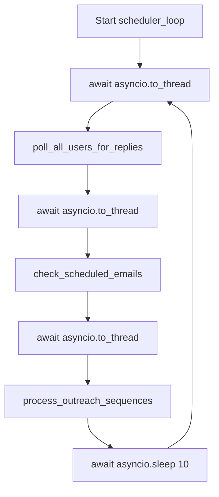

# Scheduler Loop

**File**: `backend/app/main.py:30-43`
**Interval**: Every 10 seconds
**Type**: `asyncio` background task using `asyncio.to_thread()` for synchronous code

## Flow



## Why this order matters

1. **poll_all_users_for_replies** runs FIRST — detects new replies, sets `is_responded=TRUE`, `followup_status='STOPPED'`
2. **check_scheduled_emails** runs SECOND — sends scheduled emails (transitions from `SCHEDULED` to `SENT`, sets `followup_status='ACTIVE'`)
3. **process_outreach_sequences** runs THIRD — picks leads due for follow-ups, but only those where `is_responded=FALSE` and `followup_status='ACTIVE'`

This ensures: if someone replies 2 seconds after receiving a scheduled email, the reply is processed before the first follow-up can be sent.

## Working hours enforcement

- `_is_working_hours()` in `followup_service.py:366-372`
- Runs: Mon-Fri, 10:00 - 16:59 IST
- The SAME check is re-run mid-batch before EACH send (`_recheck_working_hours()`)
- If the clock ticks past 5PM mid-batch, remaining sends are aborted

## Error handling

Each step is wrapped in `try/except` at `main.py:41`:
```python
except Exception as e:
    print(f"Scheduler error: {e}")
```

Individual steps also have their own internal error handling (e.g., polling handles per-user errors without crashing the whole loop).
