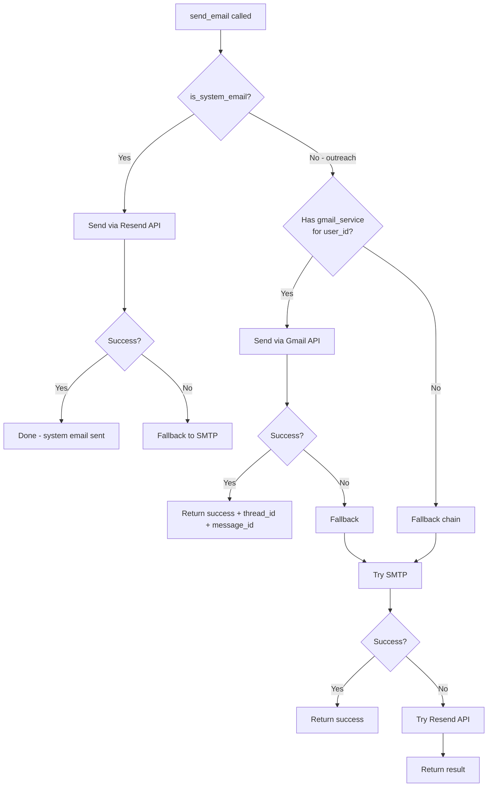

# Email Dispatch

**File**: `backend/app/services/email_service.py`
**Function**: `send_email()` (primary dispatch)
**Fallback chain**: Gmail API → SMTP → Resend

## Dispatch Flow



## Gmail API Send (Primary)

**File**: `email_service.py` (lines ~300-450, in `send_via_gmail` or inline)

1. Creates MIME message with `To`, `From`, `Subject`, `In-Reply-To` (for threading), `References`
2. Attaches PDFs if provided (company profile, executive summary)
3. Calls `service.users().messages().send(userId='me', body=...)`
4. Returns RFC `Message-ID` and Gmail `threadId` for follow-up threading

**Key threading headers**:
- `In-Reply-To`: set to parent message's RFC Message-ID (from `gmail_message_id`)
- `References`: same as In-Reply-To
- Without these, Gmail won't thread the follow-up with the original message

## SMTP Fallback

**File**: `.env` config:
```ini
EMAIL_PROVIDER=smtp
SMTP_USER=harshbisht180@gmail.com
SMTP_PASS=...
SENDER_EMAIL=harshbisht180@gmail.com
SMTP_SERVER=smtp.gmail.com
SMTP_PORT=587
```

Used when Gmail API fails. Only one SMTP account configured (Harsh's Gmail).

## Resend Fallback (System Emails)

**File**: `.env`:
```ini
RESEND_API_KEY=re_...
```

Used for:
- System emails (notifications, confirmations)
- Fallback when Gmail API and SMTP both fail
- Transactional emails (reschedule confirmations, etc.)

## Scheduled Email Dispatch

**Function**: `check_scheduled_emails()` (`email_service.py`)

1. Queries: `SELECT ... FROM leads_raw WHERE email_status = 'SCHEDULED' AND scheduled_at <= NOW()`
2. For each: sends the email
3. Post-send: updates `email_status = 'SENT'`, `followup_status = 'ACTIVE'`, `followup_stage = 0`, `is_responded = FALSE`
4. Logs activity: `EMAIL_SENT`

## Attachment Handling

- **PDF pitch decks**: Uploaded to Google Drive, link stored in `pitch_deck_url`
- **Company profiles**: Attached to the email MIME message
- **Executive summaries**: Attached to the email MIME message

## Thread Healing

If a lead has no `gmail_thread_id` when sending a follow-up (`followup_service.py:551-604`):

1. Search Gmail Sent folder for messages to this recipient
2. Find the latest sent message
3. Extract its `threadId` and `Message-ID`
4. Update the lead's `gmail_thread_id` and `gmail_message_id`
5. Proceed with sending the follow-up using these IDs

This handles cases where leads were imported from another system without thread IDs.
