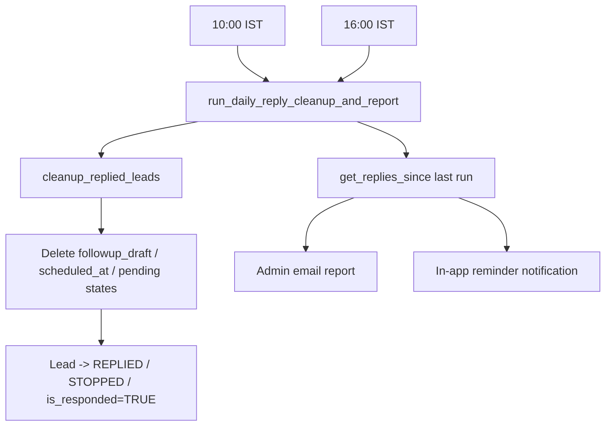

# Reply Monitoring & Follow-up Cleanup (10:00 & 16:00 IST)

**Files**:
- `backend/app/services/reply_cleanup_service.py` — cleanup + report + notification logic
- `backend/app/main.py:45-78` — `reply_cleanup_loop()` scheduled at 10:00 & 16:00 IST
- `backend/app/api/gmail.py` — `handle_potential_reply` (real-time stop + cleanup)
- `backend/app/services/email_service.py` — `check_scheduled_emails` guard
- `backend/scripts/run_reply_cleanup.py` — manual trigger (`--dry-run` supported)

## Purpose

Reply detection already runs every 10s (`poll_all_users_for_replies`) plus
real-time via Gmail Pub/Sub, and `handle_potential_reply` already stops
follow-ups (`followup_status='STOPPED'`). This flow adds the missing pieces:

1. **Delete remaining generated follow-ups** — `followup_draft` is cleared,
   `followup_approved` reset, `scheduled_at` cancelled, and pending states
   (`PENDING_APPROVAL`/`APPROVED`/`SCHEDULED`/`DRAFT`/`PENDING`) are moved to
   `REPLIED`/`CLOSED`.
2. **Move the lead into "replied"** — `email_status=REPLIED` (or `CLOSED` for
   `NOT_INTERESTED`), `followup_status='STOPPED'`, `is_responded=TRUE`.
3. **Daily report + notification** — at 10:00 & 16:00 IST an admin email and an
   in-app reminder list all replies detected since the previous run.

## Flow



### Cleanup selection

A lead is cleaned only if it has a **reply signal**:
`is_responded=TRUE OR email_status IN ('REPLIED','CLOSED') OR reply_intent IS NOT NULL`

...AND still has **remaining follow-ups**:
`followup_status` in ACTIVE/SCHEDULED/PENDING_APPROVAL/APPROVED/IDLE, or
`email_status` in PENDING_APPROVAL/APPROVED/SCHEDULED/DRAFT/PENDING, or
`followup_draft`/`followup_approved` set.

**Safety**: leads with `followup_status='ACTIVE'` and an **unknown/empty
`reply_intent`** are excluded — the reply workflow deliberately keeps those
`ACTIVE` for manual review instead of silently stopping outreach.

**Warm leads**: replied leads with intent `INTERESTED`/`MEETING_REQUESTED` keep
`followup_status='MEETING_REQUIRED'` (the reply workflow's meeting state) — the
pending follow-up content is still deleted and auto-emails stay stopped, but
the warm-lead meeting workflow remains intact.

### Report dedup

`handle_potential_reply` writes a `REPLY_DETECTED` activity-log entry per
processed reply. The report lists `REPLY_DETECTED` entries newer than the
stored `reply_report_last_run` timestamp in the `app_settings` table, so each
reply appears in exactly one report. The first run looks back 24h.

### Scheduled-email guard

`check_scheduled_emails()` now skips any lead with `is_responded=TRUE` or
`followup_status='STOPPED'` — a scheduled follow-up can never fire after a
reply has been received (covers same-email/same-company leads that were only
stopped, not fully cleaned).

## Real-time integration

`handle_potential_reply` now also:
- logs `REPLY_DETECTED` for the replied lead
- calls `cleanup_replied_leads()` so remaining follow-ups are deleted
  immediately (idempotent, only touches reply-signal leads)

## Manual trigger

```bash
python scripts/run_reply_cleanup.py            # full run
python scripts/run_reply_cleanup.py --dry-run  # read-only preview
```
