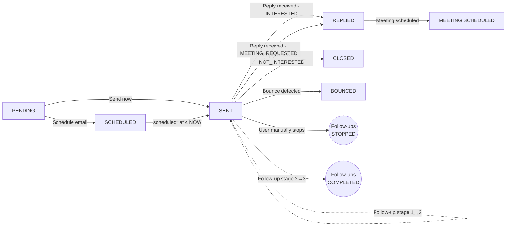

# Lead Lifecycle

A lead travels through several states. Each state transition is triggered by a specific action.

## State Machine

## email_status Values

| Status | Meaning | Set By |
|--------|---------|--------|
| `PENDING` | Lead created, no action yet | Lead import, manual entry |
| `SCHEDULED` | Email scheduled for future delivery | `POST /api/drafts/schedule` |
| `SENT` | Email sent, waiting for reply | `send_email()`, `check_scheduled_emails()` |
| `REPLIED` | Lead replied (INTERESTED/MEETING_REQUESTED) | `handle_potential_reply()` |
| `CLOSED` | Lead replied NOT_INTERESTED | `handle_potential_reply()` |
| `BOUNCED` | Email bounced, invalid address | `poll_all_users_for_replies()` bounce handler |
| `INTERESTED` | (Legacy/redundant — same as REPLIED) | Historical |
| `MEETING SCHEDULED` | Meeting was scheduled | Manual action |

## followup_status Values

| Status | Meaning | Set By |
|--------|---------|--------|
| `IDLE` | No follow-up sequence active | Default |
| `ACTIVE` | Follow-ups are being sent | `check_scheduled_emails()`, `POST /api/drafts/send` |
| `STOPPED` | Follow-ups stopped (reply received or user action) | `handle_potential_reply()`, user action |
| `COMPLETED` | All follow-up stages done (stage ≥ 3) | `process_outreach_sequences()` |

## followup_stage Values

| Stage | Meaning |
|-------|---------|
| 0 | Initial email sent, awaiting first follow-up |
| 1 | First follow-up sent |
| 2 | Second follow-up sent |
| 3 | Third follow-up sent (max — sequence COMPLETED) |

## Triggers that change state

| Action | Before | After | Code Location |
|--------|--------|-------|---------------|
| Lead created | — | email_status=PENDING, followup_status=IDLE | `leads.py`, `ingest.py` |
| Email scheduled | PENDING | SCHEDULED | `drafts.py` `POST /api/drafts/schedule` |
| Email sent now | PENDING | SENT, followup_status=ACTIVE, followup_stage=0 | `drafts.py` dispatch |
| Scheduled email fires | SCHEDULED | SENT, followup_status=ACTIVE, followup_stage=0 | `email_service.py` `check_scheduled_emails()` |
| Reply received | SENT | REPLIED/CLOSED, is_responded=TRUE, followup_status=STOPPED | `gmail.py` `handle_potential_reply()` |
| Bounce detected | SENT | BOUNCED, followup_status=STOPPED | `gmail.py` polling |
| Follow-up sent | SENT | SENT (stage increments) | `followup_service.py` |
| Max follow-ups | SENT | followup_status=COMPLETED | `followup_service.py` |
| User stops | any | followup_status=STOPPED | Admin UI, API |

## Key Fields Affecting Flow

| Field | Effect |
|-------|--------|
| `is_responded = TRUE` | Follow-up engine skips this lead |
| `reply_intent` in `('INTERESTED', 'MEETING_SCHEDULED', 'NOT_INTERESTED')` | Follow-up engine skips |
| `email_status` in `('REPLIED', 'INTERESTED', 'MEETING SCHEDULED', 'NOT_INTERESTED', 'BOUNCED')` | Follow-up engine skips |
| `followup_status != 'ACTIVE'` | Follow-up engine skips |
| `followup_stage >= 3` | Follow-up engine skips (COMPLETED) |
