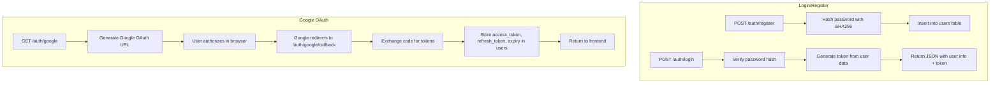

# Authentication & OAuth

**Files**: `backend/app/api/auth.py`, `backend/app/services/google_service.py`

## Authentication Flow



## Google OAuth Scopes

```python
SCOPES = [
    'https://www.googleapis.com/auth/gmail.readonly',   # Read inbox for reply detection
    'https://www.googleapis.com/auth/gmail.send',       # Send emails as the user
    'https://www.googleapis.com/auth/gmail.modify',     # Modify labels (optional)
    'https://www.googleapis.com/auth/userinfo.email',   # Get user's email address
    'https://www.googleapis.com/auth/calendar.events',  # Create calendar events for meetings
    'https://www.googleapis.com/auth/drive.file',       # Upload pitch decks to Drive
    'openid'                                             # OpenID Connect
]
```

## Token Storage & Refresh

1. Tokens stored in `users` table: `google_access_token`, `google_refresh_token`, `google_token_expiry`
2. `get_user_credentials()` checks expiry and refreshes automatically
3. On refresh failure:
   - `invalid_scope` → user must re-authenticate
   - Other errors → retry
4. Cached in `_gmail_service_cache` dict (module-level, per user_id) to avoid rebuilding on every call

## Gmail Watch Registration

After OAuth, the system registers a Gmail watch for push notifications:

```python
def register_gmail_watch(user_id):
    request = {
        'labelIds': ['INBOX'],
        'topicName': os.getenv("GMAIL_WATCH_TOPIC")  # Pub/Sub topic
    }
    service.users().watch(userId='me', body=request).execute()
```

This tells Google to push new INBOX messages to the Pub/Sub topic, which forwards to `/api/gmail/pubsub-push`.

Watches expire every 7 days and are renewed by `renew_all_gmail_watches()` (currently commented out in the maintenance loop).

## Gmail API Service

```python
def get_gmail_service(user_id):
    creds = get_user_credentials(user_id)
    if not creds:
        return None
    # Build and cache the service
    service = build('gmail', 'v1', credentials=creds)
    _gmail_service_cache[user_id] = service
    return service
```

- **Cache key**: `user_id` (integer)
- **Invalidation**: On token refresh failure
- **Format**: `metadata` (preferred) vs `full` (for body extraction)
