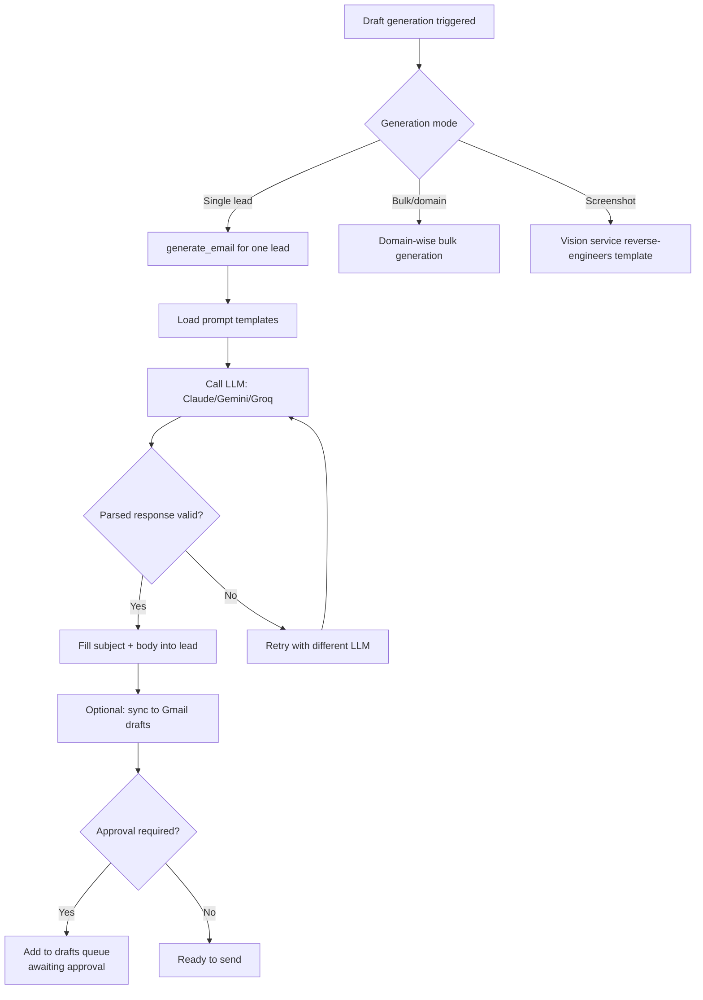

# AI Draft Generation

**Files**: `backend/app/services/llm_services.py`, `backend/app/api/drafts.py`

## Draft Generation Flow



## AI Providers

The system tries LLMs in order:

| Priority | Provider | Model | Use Case |
|----------|----------|-------|----------|
| 1 | **Claude** | `claude-sonnet-4-20250514` | Primary email generation, classification |
| 2 | **Gemini** | `gemini-2.0-flash` | Fallback for generation |
| 3 | **Groq** | `mixtral-8x7b-32768` | Fallback for simpler tasks |

Each has API keys in `.env`:
```ini
ANTHROPIC_API_KEY=sk-...
GEMINI_API_KEY=AIza...
GROQ_API_KEY=gsk_...
```

## Prompt Templates

Stored in `prompts` table with types:

| Type | Purpose | Example Context |
|------|---------|-----------------|
| `EMAIL_GENERATION` | Generate outreach email | Tone, sector context, lead info |
| `CLASSIFICATION` | Classify lead type | Name, email, company, industry |
| `STRATEGY` | Strategy guidelines | Company positioning, value prop |
| `CONTEXT` | Company context | What LeadStream does |
| `FOLLOWUP_GENERATION` | Generate follow-up | Original email, lead name |

Each user can have custom prompt templates.

## Key LLM Functions

| Function | Purpose | Returns |
|----------|---------|---------|
| `classify_reply(body)` | Classify inbound reply intent | JSON: intent, deal_size, sentiment, urgency, rejection_reason |
| `generate_email(lead_data)` | Generate outreach email | JSON: subject, body |
| `generate_followup(context)` | Generate follow-up text | String |
| `classify_lead(info)` | Classify lead as Client/Investor | Category + sector |

## Reply Classification Schema

```json
{
  "intent": "MEETING_REQUESTED | INTERESTED | NEEDS_MORE_INFO | NOT_INTERESTED",
  "deal_size": "monetary value or null",
  "sentiment_score": 0-100,
  "urgency_level": "HIGH | MEDIUM | LOW",
  "rejection_reason": "short summary or null",
  "proposed_meeting_date": "ISO date or null",
  "proposed_meeting_text": "raw text or null"
}
```

## Draft Approval Workflow

1. AI generates draft → stored in `leads_raw.email_draft`
2. Manual approval via `Emails.jsx` frontend page (draft queue)
3. On approval: email is either sent immediately or scheduled
4. Rejection: user can provide reason and edit
5. Activity logged: `DRAFT_GENERATED`, `EMAIL_SENT`, `EMAIL_REJECTED`, `EMAIL_SCHEDULED`
